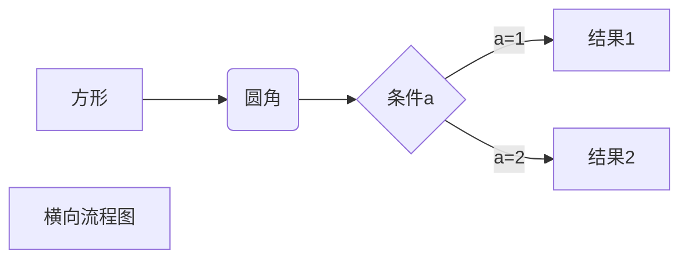
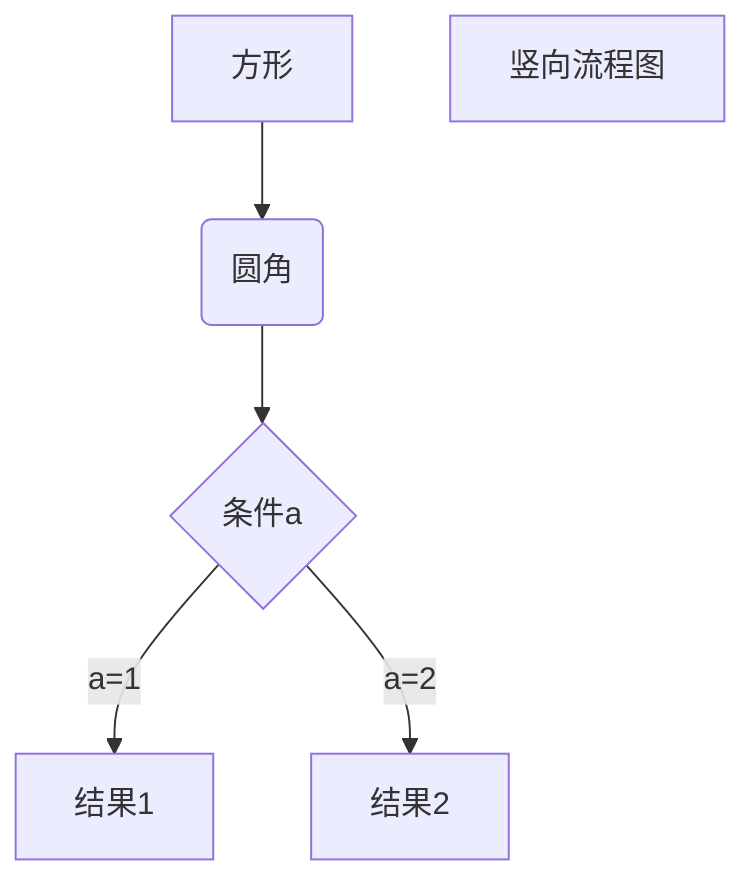

# MarkDown基本语法

[文章来源菜鸟教程](https://www.runoob.com/markdown/md-tutorial.html)

## 标题

1、使用 = 和 - 标记一级和二级标题
```
我展示的是一级标题
=================

我展示的是二级标题
-----------------
```
2、使用 # 号标记
```
# 一级标题
## 二级标题
### 三级标题
#### 四级标题
##### 五级标题
###### 六级标题
```

## 段落

1.语句末尾使用两个以上空格
```
baidu.com     
google.com
```
2.两天语句中间使用空行
```
baidu.com

google.com
```

## 字体
```
*斜体*
_斜体_
**粗体**
__粗体__
***粗斜体***
___粗斜体___
```

## 分割线

你可以在一行中用三个以上的星号、减号、底线来建立一个分隔线，行内不能有其他东西。你也可以在星号或是减号中间插入空格。下面每种写法都可以建立分隔线：
```
***

---
```

## 删除线
```
~~删除线~~
```

## 下划线
```
<u>下划线</u>
```

## 脚注
```
[^要注明的文本]
```
以下实例演示了脚注的用法：
```
创建脚注格式类似这样 [^RUNOOB]。

[^RUNOOB]: 菜鸟教程 -- 学的不仅是技术，更是梦想！！！
```
效果：    
创建脚注格式类似这样 [^RUNOOB]。

[^RUNOOB]: 菜鸟教程 -- 学的不仅是技术，更是梦想！！！

## 列表

Markdown 支持有序列表和无序列表。

无序列表使用星号(*)、加号(+)或是减号(-)作为列表标记，这些标记后面要添加一个空格，然后再填写内容：
```
* 第一项
* 第二项

- 第一项
- 第二项
```
有序列表使用数字并加上 . 号来表示，如：
```
1. 第一项
2. 第二项
```
列表嵌套只需在子列表中的选项前面添加四个空格即可：
```
1. 第一项：
    - 第一项嵌套的第一个元素
    - 第一项嵌套的第二个元素
2. 第二项：
    - 第二项嵌套的第一个元素
    - 第二项嵌套的第二个元素
```

## 区块

Markdown 区块引用是在段落开头使用 > 符号 ，然后后面紧跟一个空格符号：
```
> 区块引用
```
另外区块是可以嵌套的，一个 > 符号是最外层，两个 > 符号是第一层嵌套，以此类推：
```
> 最外层
> > 第一层嵌套
> > > 第二层嵌套
```

## 代码块

如果是段落上的一个函数或片段的代码可以用反引号把它包起来（`），例如：
```
`printf()` 函数
```

多行使用`````包裹一段代码，并指定一种语言（也可以不指定）或代码区块使用 4 个空格或者一个制表符（Tab 键）。：
    ```
    $(document).ready(function () {
        alert('RUNOOB');
    });
    ```

## 链接

```
[链接名称](链接地址)

或者

<链接地址>
```
高级链接：
```
这个链接用 1 作为网址变量 [Google][1]
这个链接用 runoob 作为网址变量 [Runoob][runoob]
然后在文档的结尾为变量赋值（网址）

  [1]: http://www.google.com/
  [runoob]: http://www.runoob.com/
```

## 图片

```


```

## 表格

```
|  表头   | 表头  |
|  ----  | ----  |
| 单元格  | 单元格 |
| 单元格  | 单元格 |
```
对齐方式：
- `-:` 设置内容和标题栏居右对齐。
- `:-` 设置内容和标题栏居左对齐。
- `:-:` 设置内容和标题栏居中对齐。

```
| 左对齐 | 右对齐 | 居中对齐 |
| :-----| ----: | :----: |
| 单元格 | 单元格 | 单元格 |
| 单元格 | 单元格 | 单元格 |
```
效果：
| 左对齐 | 右对齐 | 居中对齐 |
| :-----| ----: | :----: |
| 单元格 | 单元格 | 单元格 |
| 单元格 | 单元格 | 单元格 |

## 流程图

1、横向流程图源码格式：
    ```mermaid
    graph LR
    A[方形] -->B(圆角)
        B --> C{条件a}
        C -->|a=1| D[结果1]
        C -->|a=2| E[结果2]
        F[横向流程图]
    ```



2、竖向流程图源码格式：
    ```mermaid
    graph TD
    A[方形] --> B(圆角)
        B --> C{条件a}
        C --> |a=1| D[结果1]
        C --> |a=2| E[结果2]
        F[竖向流程图]
    ```



3、标准流程图源码格式：
    ```flow
    st=>start: 开始框
    op=>operation: 处理框
    cond=>condition: 判断框(是或否?)
    sub1=>subroutine: 子流程
    io=>inputoutput: 输入输出框
    e=>end: 结束框
    st->op->cond
    cond(yes)->io->e
    cond(no)->sub1(right)->op
    ```

```flow
st=>start: 开始框
op=>operation: 处理框
cond=>condition: 判断框(是或否?)
sub1=>subroutine: 子流程
io=>inputoutput: 输入输出框
e=>end: 结束框
st->op->cond
cond(yes)->io->e
cond(no)->sub1(right)->op
```

4、标准流程图源码格式（横向）：
    ```flow
    st=>start: 开始框
    op=>operation: 处理框
    cond=>condition: 判断框(是或否?)
    sub1=>subroutine: 子流程
    io=>inputoutput: 输入输出框
    e=>end: 结束框
    st(right)->op(right)->cond
    cond(yes)->io(bottom)->e
    cond(no)->sub1(right)->op
    ```

```flow
st=>start: 开始框
op=>operation: 处理框
cond=>condition: 判断框(是或否?)
sub1=>subroutine: 子流程
io=>inputoutput: 输入输出框
e=>end: 结束框
st(right)->op(right)->cond
cond(yes)->io(bottom)->e
cond(no)->sub1(right)->op
```


**首行缩进**
```
【1】 &ensp;或&#8194; //半角
【2】 &emsp;或&#8195; //全角
【3】 &nbsp;或&#160;
```