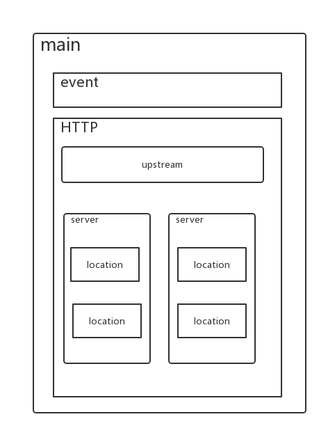

# Nginx for Windows
> 安装并注册成Windows服务https://blog.csdn.net/qq_36949713/article/details/83108149

**nginx配置关系图**

[配置文档解读来自博客园biglittleant](https://www.cnblogs.com/biglittleant/p/8979852.html)

nginx配置文件主要分为四个部分：

main（全局设置）
http ( )
upstream（负载均衡服务器设置）
server（主机设置）
location（URL匹配特点位置的设置）

server部分的指令主要用于指定主机和端口，upstream指令主要用于负载均衡和设置一系列的后端服务器，location部分用于匹配网页位置位置。
关系如下：
server继承main，location继承server，upstream即不会继承其他设置也不会被继承。

### haproxy和keepalived

https://www.cnblogs.com/zs-wei/p/9213961.html

https://blog.csdn.net/qq_41772936/article/details/80718014