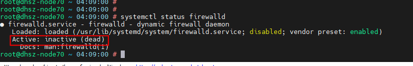
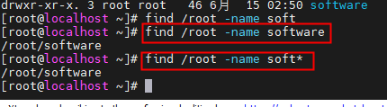

# VM Centos7安装及docker基本操作

### vm安装centos7后网络配置

- 配置文件路径 `/etc/sysconfig/network-scripts` 文件名 `ifcfg-ens33`
- 修改配置 `ONBOOT=yes`

- 重启网络 `systemctl restart network`
- 安装ifconfig  
  1. 先搜索`yum search ifconfig` (这个操作只是为了查询yum源中有没有可用的工具，可以直接操作步骤2)
  2. 安装`yum install net-tools.x86_64`

- 查看虚拟机ip地址 `ifconfig`


### linux基本操作

- 目录切换 `cd`
  - 根目录 `cd /`
  - 上一层目录 `cd ..`
  - 当前目录 `.`
- 删除 `rm`
  - 删除当前目录所有文件 `rm -rf ./*` **<font color="red">(此操作同命令 `rm -rf /*` 命令相似度极高，使用时需谨慎)</font>**
  - 删除当前目录test文件夹 `rm -rf test` 或 `rm -rf ./test`
- 复制 `cp`
  - 复制当前目录test.txt文件 `cp ./test.txt ./test1.txt` 命令参数： `cp 源路径 目标路径`
- 移动 `mv`
  - 使用mv命令重命名test.txt文件 `mv text.txt text1.txt` 命令参数：`mv 源路径 目标路径`
- 查看文件 `cat/tail`
  - 查看test.txt文件 `cat test.txt/tail test.txt`
  - tail命令默认查询文件最后十行
    - `-n` 参数可以指定查看行数`tail -n 100 test.txt`
    - `-f` 参数可以动态监控文件变化`tail -f test.txt`
- 编辑文件 `vi/vim`
  - 编辑文件test.txt `vim test.txt` 执行命令后默认为命令模式
  
  - 按 `i` 键进入输入模式,可以进行编辑
  
  - 编辑完成后按 `esc` 键进入底线命令模式,输入：`:wq` 按回车，保存并退出
  
- 创建目录 `mkdir`
  - `-p` 参数支持创建多层目录
- 创建文件 `touch`
- 列出当前目录文件 `ls`
  - 列出详情信息 `ls -l` 或者使用别名 `ll`
  
- 查看当前登录可以使用的所有别名 `alias`
- 系统状态命令 `systemctl`
  - 如：查看防火墙状态 `systemctl status firewalld`
  
  - 关闭`systemctl stop firewalld` 开启`systemctl start firewalld`
  - 开机启动`systemctl enable firewalld`
  - 取消开机启动`systemctl disable firewalld`
- 查找命令 `find`

- 修改权限 `chmod`
  - 修改test.txt文件读写执行权限 `chmod 700 test.txt`
  - 修改test目录及其子目录及文件权限 `chmod 700 -R ./test`

### docker安装

```
# 安装依赖包及存储源/阿里云源
yum install yum-utils
yum-config-manager --add-repo http://mirrors.aliyun.com/docker-ce/linux/centos/docker-ce.repo

# 安装docker/默认安装最新版
yum install docker-ce

# 设置开机启动
systemctl enable docker
```
### docker基本操作

```
# 生成镜像
docker build -t test:1.0 .
# 查看镜像
docker images
# 删除镜像
docker rmi 镜像id
# 拉取镜像
docker pull <repository>:<tag>
# 查询镜像
docker search nginx

# 查看容器
docker ps -a
# 删除容器
docker rm 容器id

# 运行镜像生成容器
  -d 保持后台进程运行
  -p 端口映射，{主机端口}:{容器端口}
  -v 目录映射，{主机路径}:{容器路径}
  --name 要生成的容器名
  imageName 镜像名称/镜像id
docker run --name containerName -d -p 80:80 -v {/data/}:{/user/publish/} imageName

# 进入容器
docker exec -it containerName /bin/bash

# docker cp命令
# 将主机/www/runoob目录拷贝到容器96f7f14e99ab的/www目录下
docker cp /www/runoob 96f7f14e99ab:/www/
将容器96f7f14e99ab的/www目录拷贝到主机的/tmp目录中
docker cp 96f7f14e99ab:/www /tmp/

# 解决镜像创建docker容器内无法连接外网
docker build -t net5test -f Dockerfile . --network=host
```